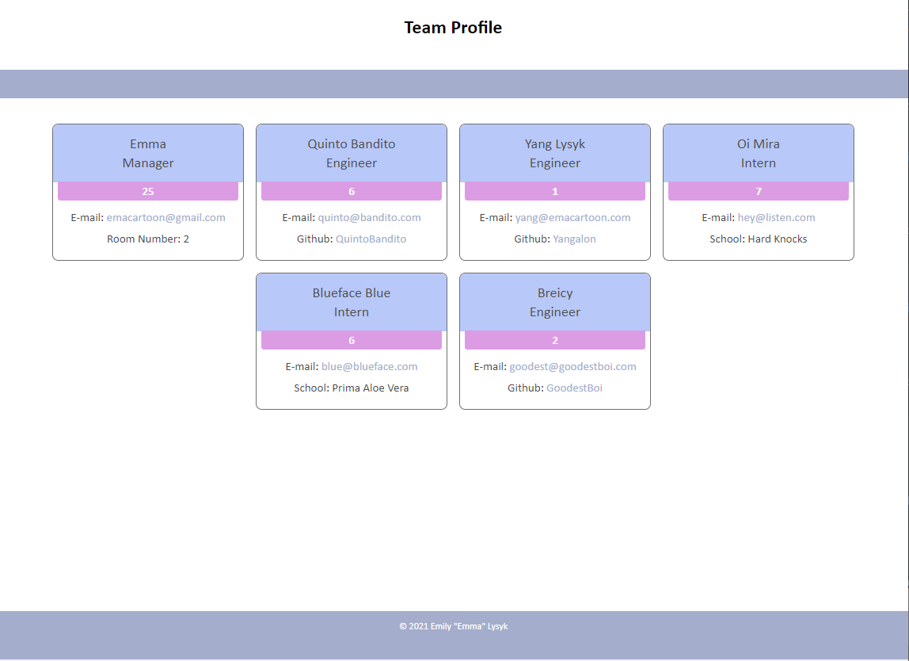

# Team Profile Generator

## Table of Contents

* [License](#license)
* [Links](#links)
* [Installation Instructions](#installation-instructions)
* [My Usage](#my-usage)
* [Technology Used](#technology-used)
* [Tests](#tests)
* [Mockups and Screenshots](#mockups-and-screenshots)
* [Questions](#questions)
* [Credits](#credits)
 
  
## License

* [](https://opensource.org/licenses/MIT)
  
## Links

* Github Repository: https://github.com/emacartoon/Team-Profile-Generator
* Github ReadMe Page: https://emacartoon.github.io/Team-Profile-Generator
* Video Walkthrough: https://drive.google.com/file/d/155B7EuSnbN5QsIEl_4LMKIEDm1FOs2BU/view
  
## Installation Instructions

After you clone down your repo, you will need to install Node.js in your environment. This should be easily achieved with:

```
npm i
```

To run the generator, use Node to run the index script:
```
node index.js
```

Follow the prompts in your Terminal, and an index.html file will be created in your dist folder.


## My Usage

Run this script when you'd like to generate an easy to find and read Team or Employee directory with Names, Titles, Employee IDs, E-mail addresses, and other information based on the position.
  
## Technology Used

JavaScript, HTML, and CSS
  

  
## Tests

```
npm test
```
  
## Mockups and Screenshots

Screenshot of HTML output
  
## Questions

If you have any questions about this project, or happen to use this project, please reach out to me!
Email: emacartoon@gmail.com
GitHub: @EmaCartoon


## Credits

Help with syntax came from Brad Tomlinson, Kate Biernat, and Brett Freeman. Special shoutout to Clark Tyra, TA, for helping me figure out my for loops.

